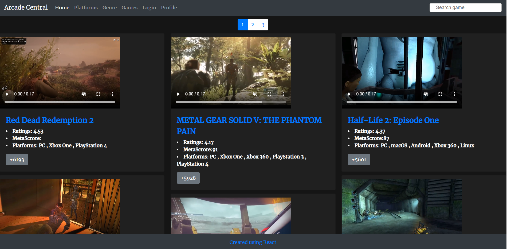

# Arcade Central

### Overview
This app is developed as project work for of Georgia Tech Coding Bootcamp.

Arcade Central is a React,Node.js based web app. This app use [RAWG Video Games Database](https://rapidapi.com/accujazz/api/rawg-video-games-database/endpoints),The largest open video games database.App also allows user to search video games based on their platform, genre.
When user clicks on games title, app displays game data such as age rating, video clips, meta score, game website, description. User can save these details in his/her profile by clicking "Add to Favorite" button.Once a game is added to user's profile, user can revisit or remove the game from profile.

### Demo
Check the app at [ https://reactarcadecentral.herokuapp.com/]( https://reactarcadecentral.herokuapp.com/)

### Built with
* [ReactJS](https://reactjs.org/) - Client side user interface
* [NodeJS](https://nodejs.org/en/)
* [Express](https://expressjs.com/) - Server routing
* [reactstrap](https://reactstrap.github.io/) - React Bootstrap components
* [reactplayer](https://www.npmjs.com/package/react-player) - React Video player component
* [React Autosuggest](https://react-autosuggest.js.org/) - React search bar auto complete component
* [RAWG API] (https://rapidapi.com/accujazz/api/rawg-video-games-database/endpoints) - Largest open video games database API
* [mongoose](https://mongoosejs.com/) - ORM for MongoDB
* [MongoDB] (https://www.mongodb.com/) - Document based database

### Steps to install the app
* Clone this repository
* change directory to project-3
* install node dependancies using command `npm install`
* Start the webserver and app using command `npm start`
* Default port number for Express server is 3001 and port number where app runs is 3000. 
 In your browser check url "http://localhost:3000" to view the app.
 
 ### Contributors
 Please check [here](https://github.com/pshegde123/project-3/graphs/contributors) for list of contributors.
 
